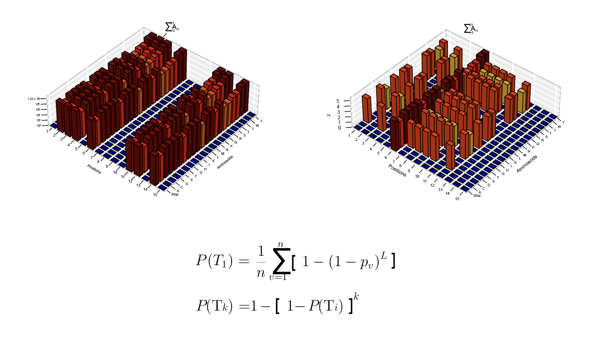

# Top Variants
<a href="https://zenodo.org/doi/10.5281/zenodo.10895769"></a>
  
  

  
This script calculates the probability of finding the top variant in a library of sequences and the probability of finding the top K variants as [Nov published it in 2012](https://doi-org.insb.bib.cnrs.fr/10.1128/AEM.06265-11). The results from his paper were reproduced and can be found as a script in the examples folder. This script builds on top, with the ability to mix different proportions of NNS, DKS or NNN strategies. In the example, 7 DKS + 1 NNS position and 7 NNS positions were applied. 
A computer with a good GPU is recommended to handle the load. 

## Usage
  
Install requirements.txt using python>3.0
```bash
python3 top_variants.py [OPTIONS]
```


## Options

- `--output_dir`: Output directory (default: "output")
- `--get_top_k_variants`: Get top k variants
- `--probability_T1`: Probability of finding the top variant (default: 0.8371929152161488)
- `--ks_list`: List of k values concatenated by commas, e.g., "1,10,100,1000" (default: "1,10,100,1000")
- `--degeneracy_strategy_list`: List of degeneracy strategies concatenated by commas, e.g., "NNN,NNS,DKS" (default: "NNN")
- `--counts_list`: List of counts concatenated by commas, e.g., "1,2,3" (default: "3")
- `--library_size`: Library size (default: 79041)
- `--chunk_size`: Chunk size to generate the tensor probabilities (default: 1000)
- `--print_interval`: Number interval to print the iteration step (default: 100000)
- `--log_output`: Log output
- `--restart_from_iteration`: Restart from iteration

## Example

```bash
python3 ../top_variants.py --output_dir="output" --degeneracy_strategy_list="NNN" --counts_list="3" --library_size=175835 --print_interval=1000 --log_output 

python3 top_variants.py --output_dir="output" --get_top_k_variants --probability_T1=0.95 --ks_list="1,10,100,1000"
```